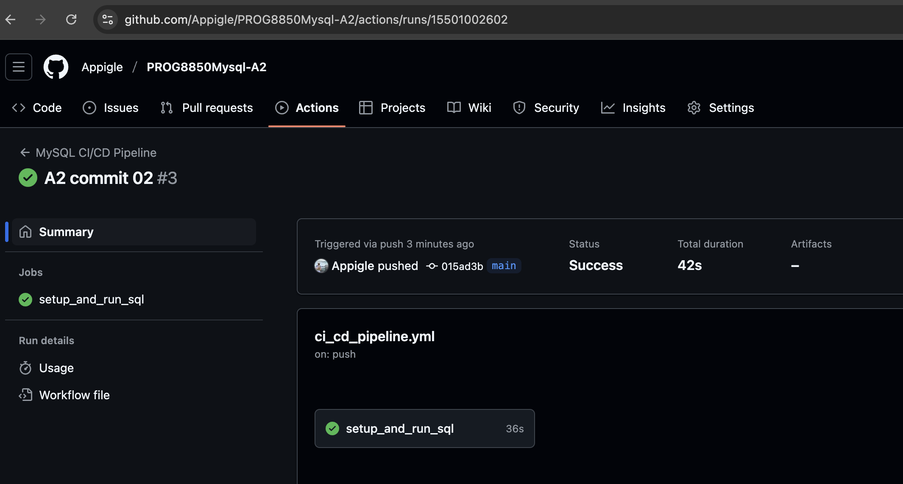
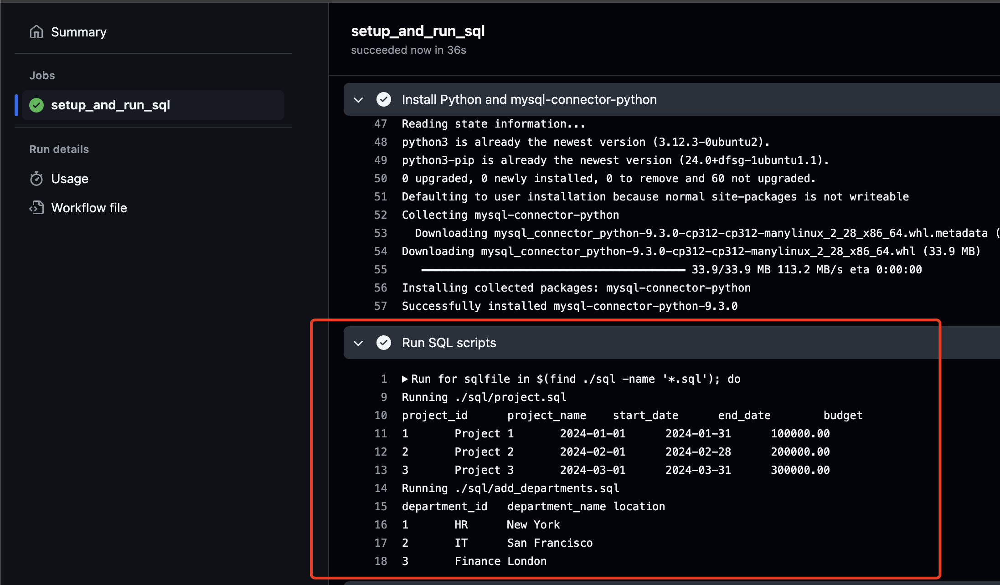

# CI/CD Pipeline Documentation

## Setting up GitHub Actions

1. **Create a GitHub Repository**

   - Initialize your project repository on GitHub.

2. **Add Workflow Configuration**

   - In your repository, create the directory structure: `.github/workflows/`.
   - Add a workflow YAML file (e.g., `ci_cd_pipeline.yml`) inside this directory.

3. **Configure the Workflow**

   - The workflow should specify the trigger (e.g., `push` to the `main` branch).
   - Set up the required services (e.g., MySQL) and environment (e.g., Python, dependencies).
   - Add steps to check out the code, install dependencies, and run your SQL scripts.

4. **Commit and Push**
   - Commit your workflow file and push it to the `main` branch.
   - GitHub Actions will automatically detect and run the workflow on every push to `main`.

## Workflow Testing and Results

### Workflow Overview

- The workflow is triggered on every push to the `main` branch.
- It sets up a MySQL 8.0 service and creates a test database.
- Installs Python and the `mysql-connector-python` library.
- Executes all SQL scripts found in the `sql` directory against the test database. 

### Testing Steps

1. **Push Code to Main**

   - Make changes to your SQL scripts or workflow file.
   - Push the changes to the `main` branch.

2. **Workflow Execution**

   - GitHub Actions will start the workflow automatically.
   - You can monitor the progress in the "Actions" tab of your repository.

3. **Step-by-Step Actions**
   - **Checkout code:** Retrieves the latest code from the repository.
   - **Wait for MySQL:** Ensures the MySQL service is ready before running scripts.
   - **Install Python & Dependencies:** Installs Python 3 and `mysql-connector-python`.
   - **Run SQL Scripts:** Executes each `.sql` file in the `sql` directory against the test database.

### Results

- Each step's output and status are visible in the GitHub Actions UI.
- If all SQL scripts execute successfully, the workflow will complete with a green checkmark.
- If any script fails, the workflow will stop and display error logs for troubleshooting.

### Output

- **Success:**
  - All steps complete without errors.
  - SQL scripts are applied to the test database.
- **Failure:**
  - The workflow stops at the failed step.
  - Error messages and logs are available for debugging.

---
